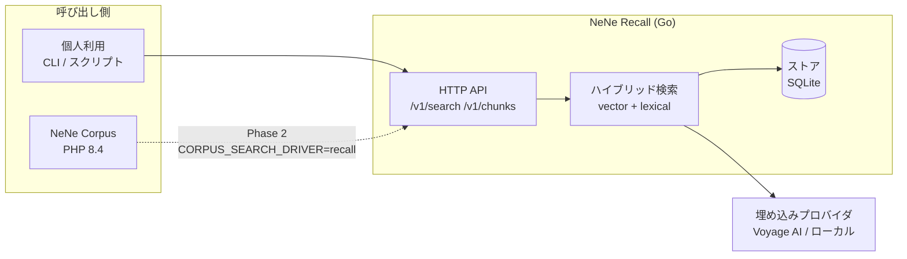
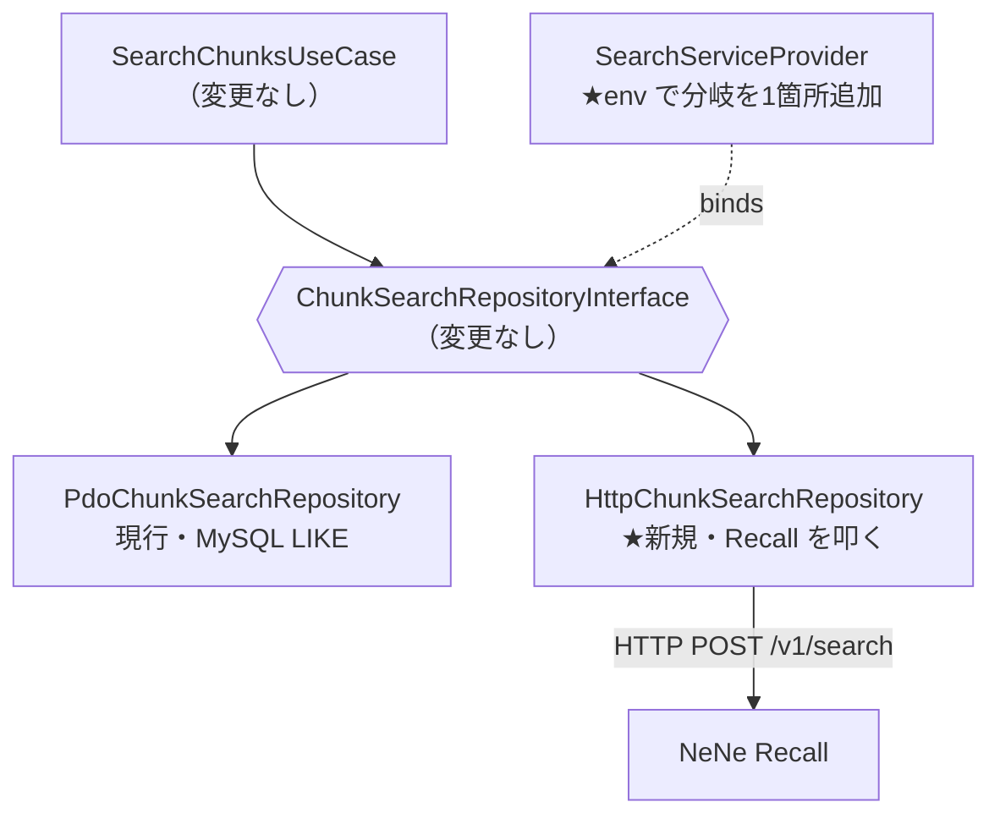

# NeNe Recall 要件定義

> Status: draft / 2026-09-01 初版
> 決定の正本は `docs/adr/`。本書はその上位にある「何を作るか」の合意文書。

---

## 1. 一言要約

**Corpus が知識を蓄え、Recall が引き出す。**

NeNe Recall は Go で書かれた自己ホスト型の検索・取得サービス。文書チャンクを取り込み、
埋め込みベクトルと語彙一致のハイブリッドで検索し、**引用可能な chunk を JSON で返す HTTP API** を提供する。

単体で完結して動く。同時に、将来 [NeNe Corpus](https://github.com/hideyukiMORI/nene-corpus) の
検索バックエンドとして環境変数ひとつで差し替えられる形を最初から取る。

---

## 2. なぜ作るか

### 2.1 個人利用の必要（先行するゴール）

手元の文書・ノート・コードに対して、引用付きで答えを引ける検索基盤が要る。
既存 SaaS に投げたくない資料が対象なので、**ローカルで完結すること**が前提。

### 2.2 Corpus の検索が RAG になっていない（実測）

`nene-corpus/src/Search/PdoChunkSearchRepository.php:47-77` の現状：

```sql
CASE WHEN c.content LIKE '%term%' THEN 1 ELSE 0 END   -- を語数ぶん加算
```

| 観測点 | 実際の挙動 |
| --- | --- |
| 分割 | `preg_split('/\s+/u')` — 空白区切りのみ |
| 照合 | `LIKE '%term%'` の部分一致 |
| スコア | ヒットした語数の整数カウント |
| 索引 | 前方一致でないため MySQL のインデックスが効かない |
| 日本語 | 分かち書きされないので、クエリ全体が部分文字列で含まれる場合しか当たらない |

ベクトル検索でも全文検索でもない。**Recall が置き換える相手は「まだ RAG になっていないもの」**であり、
差し替えの価値は最初から大きい。

---

## 3. スコープ

### 3.1 Phase 1（本要件の対象）— 単独で動く検索 API

| # | 要件 | 受け入れ条件 |
| --- | --- | --- |
| F-1 | チャンクの投入 | `POST /v1/chunks` で本文＋メタデータを受け、埋め込みを生成して永続化する |
| F-2 | チャンクの削除 | `DELETE /v1/chunks/{id}`、および `source_id` 単位の一括削除ができる |
| F-3 | 検索 | `POST /v1/search` がクエリに対し関連チャンクを score 降順で返す |
| F-4 | ハイブリッド検索 | ベクトル類似度と語彙一致を加重合成し、重みを設定で変えられる |
| F-5 | テナント分離 | すべての API が `org_id` を必須とし、他 org のチャンクは決して返らない |
| F-6 | 引用可能性 | 検索結果に `chunk_id` / `document_id` / `page_number` / `section_label` を含む |
| F-7 | 健全性確認 | `GET /healthz` が依存（DB・埋め込みプロバイダ）の状態を返す |
| F-8 | 埋め込みの差し替え | プロバイダをインタフェースで抽象化し、設定で選べる |

### 3.2 Phase 2 — Corpus 統合

| # | 要件 | 受け入れ条件 |
| --- | --- | --- |
| F-9 | Corpus 側アダプタ | `HttpChunkSearchRepository implements ChunkSearchRepositoryInterface` を Corpus に追加 |
| F-10 | 設定による切替 | `CORPUS_SEARCH_DRIVER=pdo\|recall` で `SearchServiceProvider` の束縛が切り替わる |
| F-11 | 同期 | Corpus のチャンク作成・更新・削除が Recall に伝播する |
| F-12 | 縮退 | Recall が落ちても Corpus は PDO 実装に落ちて動き続ける |

### 3.3 やらないこと（Phase 1 の非スコープ）

- LLM による回答生成 — Recall は**取得までを担当**し、生成は呼び出し側（Corpus / Concierge）の責務
- 文書のパース（PDF・CSV の読み取り）— チャンク化済みのテキストを受け取る前提
- 管理 UI — API のみ
- 認証基盤の自前実装 — トークン検証のみ行い、発行はしない

---

## 4. アーキテクチャ

### 4.1 全体像



### 4.2 Corpus との差し替え口

Corpus 側の接合部は**1メソッドのインタフェース**に既に切れている
（`nene-corpus/src/Search/ChunkSearchRepositoryInterface.php:9`）:

```php
public function search(string $query, int $limit): array;  // list<ChunkSearchResult>
```

DI 束縛も `SearchServiceProvider.php:23` の1箇所のみ。よって Phase 2 で Corpus に必要な変更は：



新規1クラス＋既存1ファイルの分岐追加で済む。ユースケース層・コントローラ層は無傷。

### 4.3 データ所有の方針

**Recall はチャンク本文を保持する。ただしレスポンスに必ず `chunk_id` を含める。**

| 方式 | 単独動作 | Corpus 統合 | 判定 |
| --- | --- | --- | --- |
| id + score のみ返す | ✗ 単独で答えを返せない | ○ 本文の正は MySQL | 却下 |
| 本文も保持し id も返す | ○ | ○ PHP が id で再構成可 | **採用** |

Corpus 統合時は、PHP 側が返された `chunk_id` で MySQL から `Chunk` を組み立て直す。
これにより **Corpus 側は Recall が返した本文を信用しない**——本文の正は常に MySQL に残り、
二重保管による表示内容の食い違いが構造的に起きない。詳細は ADR 0002。

---

## 5. 主要な設計判断

判断の正本は各 ADR。ここでは一覧と根拠の要約のみ。

| ADR | 判断 | 根拠の要約 |
| --- | --- | --- |
| [0001](adr/0001-standalone-first-corpus-swappable.md) | 単独動作を先、Corpus 統合を後 | 統合を前提にすると Corpus の開発速度に律速される。単独で価値が出れば統合は任意になる |
| [0002](adr/0002-store-content-return-chunk-id.md) | 本文を保持しつつ `chunk_id` を返す | 単独動作と本文の単一正本を両立させる唯一の形 |
| [0003](adr/0003-org-id-is-mandatory.md) | `org_id` を全 API で必須・欠落は 400 | Corpus では WHERE 句に埋まっていた分離責任が、Recall 側に移る |
| [0004](adr/0004-brute-force-cosine-no-vector-db.md) | 総当たりコサイン・ベクトル DB を使わない | 個人〜SMB 規模では十分。依存を増やさない。10万チャンクで再評価 |
| [0005](adr/0005-embedding-provider-is-pluggable.md) | 埋め込みをインタフェース化 | Anthropic は埋め込みを提供しない。自己ホストの建前上ローカル実行の道を残す必要がある |
| [0006](adr/0006-score-is-float.md) | score は float。Corpus 側を int から広げる | ベクトル類似度は float。int のままだと統合時に破壊的変更になる |

---

## 6. 埋め込みプロバイダ

### 6.1 裏取りした事実（2026-09-01 時点・一次ドキュメント）

> Anthropic does not offer its own embedding model.
> — [platform.claude.com/docs/en/build-with-claude/embeddings](https://platform.claude.com/docs/en/build-with-claude/embeddings)

Anthropic に埋め込みエンドポイントは**無い**。公式が案内するのは Voyage AI。

### 6.2 候補

| プロバイダ | モデル | 次元 | 文脈長 | 自己ホスト | 備考 |
| --- | --- | --- | --- | --- | --- |
| Voyage AI | `voyage-4` | 1024（256/512/2048 も可） | 32,000 | ✗ API | 多言語・品質と効率のバランス。既定 |
| Voyage AI | `voyage-4-large` | 同上 | 32,000 | ✗ API | 多言語検索の最高品質 |
| Voyage AI | `voyage-4-nano` | 同上 | 32,000 | **○** | Apache 2.0・Hugging Face 公開の開放重み |
| ローカル | 任意（ONNX 等） | 実装依存 | 実装依存 | ○ | 完全オフライン用の逃げ道 |

**既定は `voyage-4`。** ただし NeNe シリーズの建前は "Keep everything on your stack" なので、
外部 API 必須の設計は建前と衝突する。`voyage-4-nano` が Apache 2.0 で公開されていることが
**自己ホスト経路を現実的にする鍵**になる（ADR 0005）。

### 6.3 実装上効く性質

- Voyage の埋め込みは**長さ1に正規化済み**。よってコサイン類似度＝内積であり、
  Go 側は正規化なしの単純な内積で済む（ADR 0004 の総当たり方式と噛み合う）
- `input_type` を**必ず指定する**。取り込み時 `document`、検索時 `query`。
  省略や `None` は検索品質を落とすと公式 FAQ が明記している
- Matryoshka 構造なので、先頭 N 次元を切り出して再正規化すれば次元を落とせる。
  保存容量が問題になったときの逃げ道になる

---

## 7. API 概要

正本は `docs/openapi/openapi.yaml`。

| メソッド | パス | 用途 |
| --- | --- | --- |
| `POST` | `/v1/search` | 検索。`org_id` `query` 必須、`limit` `alpha` `filters` 任意 |
| `POST` | `/v1/chunks` | チャンク投入（バッチ可）。埋め込みはサーバ側で生成 |
| `DELETE` | `/v1/chunks/{chunk_id}` | 単体削除 |
| `DELETE` | `/v1/sources/{source_id}/chunks` | source 単位の一括削除 |
| `GET` | `/healthz` | 依存の状態 |
| `GET` | `/readyz` | 受け入れ可否 |

検索レスポンスの1件は Corpus の `ChunkSearchResult` に一対一で写せる形にする：

```json
{
  "chunk_id": 12345,
  "document_id": 67,
  "source_id": 8,
  "chunk_index": 3,
  "content": "…",
  "page_number": 12,
  "section_label": "3.2 導入手順",
  "score": 0.8213,
  "vector_score": 0.7910,
  "lexical_score": 0.9502
}
```

`vector_score` / `lexical_score` を分けて返すのは、**重み `alpha` を実データで調整するため**。
合成後の値だけでは、外した理由がベクトル側か語彙側か切り分けられない。

---

## 8. 非機能要件

| 区分 | 要件 |
| --- | --- |
| 性能 | 1万チャンクに対し検索 p95 < 200ms（埋め込み API 往復を除く） |
| 規模 | Phase 1 の想定上限 10万チャンク。超えたら ADR 0004 を再評価 |
| 可搬性 | 単一バイナリ＋SQLite ファイル。cgo 非依存でクロスコンパイル可能 |
| 秘匿 | 埋め込みプロバイダの API キーは環境変数のみ。ログ・エラー応答に出さない |
| 分離 | `org_id` 未指定は 400。既定 org へのフォールバックを実装しない |
| 可観測性 | 構造化ログ（`log/slog`）。検索は query 本文でなくハッシュを記録 |
| ライセンス | MIT（フリート標準） |

---

## 9. 未決事項

| # | 論点 | 現状 |
| --- | --- | --- |
| Q-1 | 語彙検索の実装 | SQLite FTS5 か Go 側 BM25 か。日本語の分割（bigram vs 形態素）と併せて決める |
| Q-2 | 日本語の分割方式 | bigram は依存ゼロだが精度が落ちる。形態素解析は辞書を抱える。Phase 1 は bigram で開始し実測で判断 |
| Q-3 | reranker の採用 | Voyage `rerank-2.5` が使えるが往復が増える。Phase 1 は入れない |
| Q-4 | Corpus との同期方式 | Webhook / ポーリング / Corpus からの同期書き込み。Phase 2 で決める |
| Q-5 | 認証方式 | フリートは `GuardedJwtSecretResolver` で JWT fail-close 統一済み。Go 側で同等を実装するか、単純な共有トークンにするか |

---

## 10. 関連

- [NeNe Corpus](https://github.com/hideyukiMORI/nene-corpus) — 統合先。知識の蓄積と回答生成を担当
- [NENE2](https://github.com/hideyukiMORI/NENE2) — フリートの PHP フレームワーク。Recall は Go なので継承しないが、規約は参照する
- Voyage AI 埋め込み — https://platform.claude.com/docs/en/build-with-claude/embeddings
