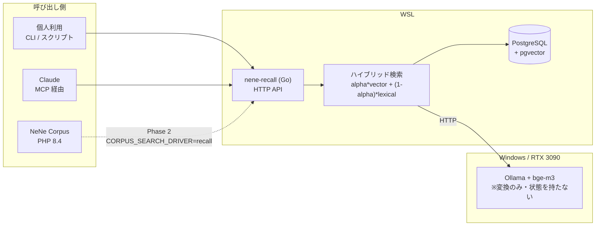
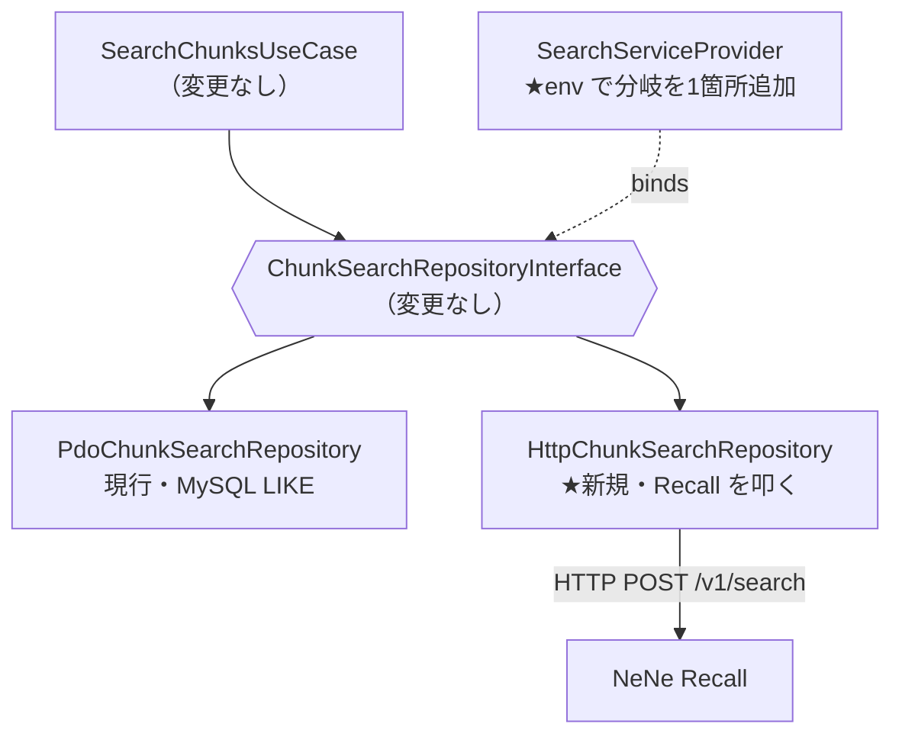

# NeNe Recall 要件定義

> Status: draft / 2026-09-01 初版 → 同日 改訂（ローカル前提・pgvector・評価をスコープに追加）
> 決定の正本は `docs/adr/`。本書はその上位にある「何を作るか」の合意文書。

---

## 1. 一言要約

**Corpus が知識を蓄え、Recall が引き出す。**

NeNe Recall は Go で書かれた自己ホスト型の検索・取得サービス。文書チャンクを取り込み、
埋め込みベクトルと語彙一致のハイブリッドで検索し、**引用可能な chunk を JSON で返す HTTP API** を提供する。

**完全にローカルで動く。** 埋め込みの生成もベクトルの保存も検索も、外部サービスを使わない。
同時に、将来 [NeNe Corpus](https://github.com/hideyukiMORI/nene-corpus) の
検索バックエンドとして環境変数ひとつで差し替えられる形を最初から取る。

---

## 2. なぜ作るか

### 2.1 個人利用の必要（先行するゴール）

手元の文書・ノート・コードに対して、引用付きで答えを引ける検索基盤が要る。
既存 SaaS に投げたくない資料が対象なので、**ローカルで完結すること**が前提。

### 2.2 実戦価値・キャリア資産としての位置づけ

施主はこのリポジトリを職務経歴上の資産としても位置づけている（2026-09-01 申告）。
この軸が設計判断に影響する。具体的には ADR 0007（pgvector 採用）と
ADR 0009（評価をスコープに含める）が、この軸から出た判断である。

**ただし判断の優先順位を明示しておく:**
**「測って決めた経路」が成果物であって、採用した製品名ではない。**
ベクトル DB の選定自体はもう差別化にならない（§5.2）。

### 2.3 Corpus の検索が RAG になっていない（実測）

`nene-corpus/src/Search/PdoChunkSearchRepository.php:47-77` の現状：

```sql
CASE WHEN c.content LIKE '%term%' THEN 1 ELSE 0 END   -- を語数ぶん加算
```

| 観測点 | 実際の挙動 |
| --- | --- |
| 分割 | `preg_split('/\s+/u')` — 空白区切りのみ |
| 照合 | `LIKE '%term%'` の部分一致 |
| スコア | ヒットした語数の整数カウント |
| 索引 | 前方一致でないため MySQL のインデックスが効かない |
| 日本語 | 分かち書きされないので、クエリ全体が部分文字列で含まれる場合しか当たらない |

ベクトル検索でも全文検索でもない。**Recall が置き換える相手は「まだ RAG になっていないもの」**であり、
差し替えの価値は最初から大きい。

---

## 3. スコープ

### 3.1 Phase 1（本要件の対象）— ローカルで完結する検索 API

| # | 要件 | 受け入れ条件 |
| --- | --- | --- |
| F-1 | チャンクの投入 | `POST /v1/chunks` で本文＋メタデータを受け、埋め込みを生成して永続化する |
| F-2 | チャンクの削除 | `DELETE /v1/chunks/{id}`、および `source_id` 単位の一括削除ができる |
| F-3 | 検索 | `POST /v1/search` がクエリに対し関連チャンクを score 降順で返す |
| F-4 | ハイブリッド検索 | ベクトル類似度と語彙一致を加重合成し、重み `alpha` を設定で変えられる |
| F-5 | テナント分離 | すべての API が `org_id` を必須とし、他 org のチャンクは決して返らない |
| F-6 | 引用可能性 | 検索結果に `chunk_id` / `document_id` / `page_number` / `section_label` を含む |
| F-7 | 健全性確認 | `GET /healthz` が依存（DB・埋め込みプロバイダ）の状態を返す |
| F-8 | 埋め込みの差し替え | プロバイダをインタフェースで抽象化し、設定で選べる |
| **F-9** | **ローカル完結** | **既定構成で外部 API を1回も呼ばずに取り込みと検索が完了する** |
| **F-10** | **検索品質の評価** | **`make eval` で recall@k・MRR・p95 を算出できる（ADR 0009）** |
| **F-11** | **ストアの選択** | **`RECALL_STORE=postgres\|sqlite` で切り替えられ、同一データで比較できる** |

### 3.2 Phase 2 — Corpus 統合

| # | 要件 | 受け入れ条件 |
| --- | --- | --- |
| F-12 | Corpus 側アダプタ | `HttpChunkSearchRepository implements ChunkSearchRepositoryInterface` を Corpus に追加 |
| F-13 | 設定による切替 | `CORPUS_SEARCH_DRIVER=pdo\|recall` で `SearchServiceProvider` の束縛が切り替わる |
| F-14 | 同期 | Corpus のチャンク作成・更新・削除が Recall に伝播する |
| F-15 | 縮退 | Recall が落ちても Corpus は PDO 実装に落ちて動き続ける |

### 3.3 やらないこと（非スコープ）

- **LLM による回答生成** — Recall は**取得までを担当**し、生成は呼び出し側（Corpus / Concierge / Claude）の責務
- **生成品質の評価**（faithfulness・answer relevancy 等）— 生成がスコープ外なので評価もスコープ外
- 文書のパース（PDF・CSV の読み取り）— チャンク化済みのテキストを受け取る前提
- 管理 UI — API のみ
- 認証基盤の自前実装 — トークン検証のみ行い、発行はしない

---

## 4. アーキテクチャ

### 4.1 全体像



**外部に出る通信は Ollama への変換リクエストのみ。データは WSL から出ない。**

### 4.2 役割分担

Ollama は**ベクトル DB ではない**。テキストを渡すとベクトルを返すだけの、状態を持たない推論サーバである。

| 仕事 | 担当 |
| --- | --- |
| テキスト → ベクトル変換 | Ollama + bge-m3（Windows / 3090） |
| ベクトルの保存 | Recall / PostgreSQL + pgvector（Go） |
| 類似度計算・スコア合成 | Recall（Go） |
| org 分離・API・チャンク管理 | Recall（Go） |
| 回答の生成 | 呼び出し側 — **Recall のスコープ外** |

検索1回で Ollama を叩くのは**クエリ文1本の埋め込みだけ**。
チャンク側との突き合わせは Postgres と Go が行う。

### 4.3 Corpus との差し替え口

Corpus 側の接合部は**1メソッドのインタフェース**に既に切れている
（`nene-corpus/src/Search/ChunkSearchRepositoryInterface.php:9`）:

```php
public function search(string $query, int $limit): array;  // list<ChunkSearchResult>
```

DI 束縛も `SearchServiceProvider.php:23` の1箇所のみ。よって Phase 2 で Corpus に必要な変更は：



新規1クラス＋既存1ファイルの分岐追加で済む。ユースケース層・コントローラ層は無傷。

### 4.4 データ所有の方針

**Recall はチャンク本文を保持する。ただしレスポンスに必ず `chunk_id` を含める。**

| 方式 | 単独動作 | Corpus 統合 | 判定 |
| --- | --- | --- | --- |
| id + score のみ返す | ✗ 単独で答えを返せない | ○ 本文の正は MySQL | 却下 |
| 本文も保持し id も返す | ○ | ○ PHP が id で再構成可 | **採用** |

Corpus 統合時は、PHP 側が返された `chunk_id` で MySQL から `Chunk` を組み立て直す。
これにより **Corpus 側は Recall が返した本文を信用しない**——本文の正は常に MySQL に残り、
二重保管による表示内容の食い違いが構造的に起きない。詳細は ADR 0002。

---

## 5. 主要な設計判断

### 5.1 一覧

判断の正本は各 ADR。ここでは根拠の要約のみ。

| ADR | 判断 | 根拠の要約 | Status |
| --- | --- | --- | --- |
| [0001](adr/0001-standalone-first-corpus-swappable.md) | 単独動作を先、Corpus 統合を後 | 統合を前提にすると Corpus の開発速度に律速される | 有効 |
| [0002](adr/0002-store-content-return-chunk-id.md) | 本文を保持しつつ `chunk_id` を返す | 単独動作と本文の単一正本を両立させる唯一の形 | 有効 |
| [0003](adr/0003-org-id-is-mandatory.md) | `org_id` を全 API で必須・欠落は 400 | 分離責任が SQL から Go 側へ移る | 有効 |
| [0004](adr/0004-brute-force-cosine-no-vector-db.md) | 総当たりコサイン・ベクトル DB を使わない | 10万件規模では十分 | **⚠ 0007 が supersede**（分析は有効） |
| [0005](adr/0005-embedding-provider-is-pluggable.md) | 埋め込みをインタフェース化 | Anthropic は埋め込みを提供しない | 有効（既定のみ 0008 が反転） |
| [0006](adr/0006-score-is-float.md) | score は float。Corpus 側を int から広げる | ベクトル類似度は float | 有効 |
| **[0007](adr/0007-pgvector-over-brute-force.md)** | **pgvector 採用。索引なしから始め実測後に HNSW** | **性能ではなく市場価値の軸から。測った経路が成果物** | 有効 |
| **[0008](adr/0008-local-embedding-by-default.md)** | **既定を Ollama + bge-m3 に反転** | **ローカル利用が前提。RTX 3090 が使える** | 有効 |
| **[0009](adr/0009-retrieval-evaluation-is-in-scope.md)** | **評価を Phase 1 の必須要件に** | **ベクトル DB 選定はもう差別化にならない。測ることが差別化** | 有効 |

### 5.2 「何が差別化になるか」の整理

2026年時点で、コサイン類似度とメタデータフィルタは**全製品が対応済み**である。
ベクトル DB の選定も、類似度計算の実装も、もう差がつかない。差がつくのは次の側面:

| 論点 | 状況 |
| --- | --- |
| **検索品質の評価**（recall@k・MRR・回帰） | ADR 0009 でスコープに追加 |
| **ハイブリッド検索の重み設計** | `alpha` と `vector_score`/`lexical_score` 分離を設計済み。ただし 0.7 は**現状ただの当て推量** |
| **日本語の分割**（bigram vs 形態素） | 未決（Q-2）。日本市場では強い差別化 |
| **マルチテナント分離** | ADR 0003 で設計済み・テストで固定済み |
| **索引を入れる判断の根拠** | ADR 0007 で「測ってから入れる」経路を定義 |
| チャンク戦略 | 未着手（分割済み前提） |

---

## 6. 埋め込みプロバイダ

### 6.1 前提となる事実（裏取り済み・2026-09-01）

**① Anthropic は埋め込みモデルを提供していない**

> Anthropic does not offer its own embedding model.
> — [platform.claude.com/docs/en/build-with-claude/embeddings](https://platform.claude.com/docs/en/build-with-claude/embeddings)

**② サブスクリプションは API アクセス権ではない**

| 契約 | 使えるもの | 埋め込み API |
| --- | --- | --- |
| ChatGPT Plus/Pro | Codex CLI（コーディングエージェント） | ✗ 別課金（platform.openai.com） |
| X Premium+ | Grok チャット | ✗ 別課金（api.x.ai） |

**③ 生成モデルは埋め込みの代替にならない**

`codex` のようなエージェントをサブプロセスで叩いて埋め込みを得ることはできない。理由は3つあり、3番目が本質:

1. ベクトルを返すエンドポイントを持っていない
2. 1回の呼び出しが秒単位。10万チャンクでは処理時間が破綻する
3. **生成モデルに「このテキストのベクトルを出せ」と頼んでも、
   それらしい数値を作文するだけで意味的な距離が保存されない。**
   埋め込みは専用に訓練された別種のモデルである

### 6.2 採用構成（既定）

| 項目 | 値 |
| --- | --- |
| 実行方式 | **Ollama を Windows ネイティブで実行**し、Recall（WSL）から HTTP で叩く |
| モデル | **`bge-m3`**（BAAI） |
| ライセンス | **MIT**（商用可） |
| 次元 | **1024** |
| 文脈長 | 8192 トークン |
| 言語 | 100言語以上・日本語に強い |
| 費用 | **0円** |

**1024次元は `voyage-4` の既定と一致する。** 将来 Voyage に切り替えてもスキーマが変わらない。

Ollama を Windows 側で走らせるのは、WSL の CUDA ユーザ空間ライブラリが未配置
（`/usr/lib/wsl/lib` が無い）ため。**そのセットアップを回避して RTX 3090 をそのまま使える。**

### 6.3 代替候補

| モデル | 次元 | 日本語 | 備考 |
| --- | --- | --- | --- |
| **`bge-m3`** | 1024 | 強い | **既定** |
| `ruri`（cl-nagoya） | 768 | 日本語特化 | 日本語だけなら最有力 |
| `multilingual-e5-large` | 1024 | 強い | ⚠️ `query: `/`passage: ` 接頭辞が**必須** |
| `nomic-embed-text` | 768 | 弱い | 英語中心。日本語には向かない |
| Voyage `voyage-4` | 1024 | 強い | 外部 API・$0.06/1M（200M 無料枠あり）。任意経路 |

### 6.4 実装上効く性質

- **`Kind` の翻訳はプロバイダ実装の責務。** `bge-m3` は接頭辞不要、`multilingual-e5` は接頭辞必須、
  Voyage は `input_type` パラメータ。**呼び出し側は常に `Kind` を渡す**（実装が使うかに関わらず）
- ベクトルは**長さ1に正規化されていること**を `Embedder` の契約とする。
  内積がそのままコサイン類似度になる
- **モデルを変えたら保存済みベクトルは無効。** 次元が一致していても比較できず、
  **エラーにならないまま無意味なスコアが返る。** `Embedder.ID()`（例 `bge-m3:1024`）の記録で検知する

---

## 7. API 概要

正本は `docs/openapi/openapi.yaml`。

| メソッド | パス | 用途 |
| --- | --- | --- |
| `POST` | `/v1/search` | 検索。`org_id` `query` 必須、`limit` `alpha` `filters` 任意 |
| `POST` | `/v1/chunks` | チャンク投入（バッチ可）。埋め込みはサーバ側で生成 |
| `DELETE` | `/v1/chunks/{chunk_id}` | 単体削除 |
| `DELETE` | `/v1/sources/{source_id}/chunks` | source 単位の一括削除 |
| `GET` | `/healthz` | 依存の状態 |
| `GET` | `/readyz` | 受け入れ可否 |

検索レスポンスの1件は Corpus の `ChunkSearchResult` に一対一で写せる形にする：

```json
{
  "chunk_id": 12345,
  "document_id": 67,
  "source_id": 8,
  "chunk_index": 3,
  "content": "…",
  "page_number": 12,
  "section_label": "3.2 導入手順",
  "score": 0.8213,
  "vector_score": 0.7910,
  "lexical_score": 0.9502
}
```

`vector_score` / `lexical_score` を分けて返すのは、**重み `alpha` を実データで調整するため**。
合成後の値だけでは、外した理由がベクトル側か語彙側か切り分けられない。

---

## 8. 非機能要件

| 区分 | 要件 |
| --- | --- |
| **費用** | **既定構成で 0円。** 有料サービス・有料ツールに依存しない（§10） |
| **オフライン** | 既定構成で外部ネットワークを必要としない（Ollama は localhost/ホスト間） |
| 性能 | 1万チャンクに対し検索 p95 < 200ms（埋め込み往復を除く）。**未実測** |
| 品質 | `make eval` で recall@k・MRR を算出できる（ADR 0009） |
| 規模 | Phase 1 の想定上限 10万チャンク。pgvector の限界（約5,000万）まで余裕がある |
| 可搬性 | ドライバは純 Go（`jackc/pgx`）。**cgo に依存せずクロスコンパイル可能** |
| 秘匿 | 埋め込み対象データを外部に送らない。API キーは環境変数のみ・ログと応答に出さない |
| 分離 | `org_id` 未指定は 400。既定 org へのフォールバックを実装しない |
| 可観測性 | 構造化ログ（`log/slog`）。検索は query 本文でなくハッシュを記録 |
| ライセンス | MIT（フリート標準） |

---

## 9. 未決事項

| # | 論点 | 現状 |
| --- | --- | --- |
| Q-1 | 語彙検索の実装 | Postgres の全文検索（`tsvector`）か Go 側 BM25 か。日本語の分割と併せて決める |
| Q-2 | 日本語の分割方式 | bigram は依存ゼロだが精度が落ちる。形態素解析は辞書を抱える。**ADR 0009 の評価で決着させる** |
| Q-3 | `alpha` の既定値 | 現状 0.7 は**根拠のない当て推量**。評価セットで最適値を探す |
| Q-4 | reranker の採用 | 往復が増える。Phase 1 は入れない |
| Q-5 | Corpus との同期方式 | Webhook / ポーリング / Corpus からの同期書き込み。Phase 2 で決める |
| Q-6 | 認証方式 | フリートは JWT fail-close 統一済み。Go 側で同等を実装するか、共有トークンにするか |
| ~~Q-7~~ | ~~Ollama のスループット~~ | **決着（2026-09-01 実測）**。実チャンク相当(230字)で **88〜93 件/秒**、10万件の取り込みで**約18分**。ただし**バッチ化が前提**——1本ずつ送ると 11.8 件/秒＝約2時間21分。正本は [`docs/benchmarks/2026-09-01-baseline.md`](benchmarks/2026-09-01-baseline.md) |

---

## 10. 費用の内訳（すべて0円）

| 要素 | ライセンス | 費用 |
| --- | --- | --- |
| Go 1.27 | BSD-3-Clause | 0円 |
| PostgreSQL | PostgreSQL License | 0円 |
| pgvector | PostgreSQL License | 0円 |
| `jackc/pgx` | MIT | 0円 |
| Ollama | MIT | 0円 |
| `bge-m3` | MIT | 0円 |
| Docker Desktop | 無料枠に該当（250人未満 **かつ** 年商$10M未満） | 0円 |
| GitHub Actions | public リポジトリは無料 | 0円 |
| RTX 3090 | 所有済み | 0円 |

**Docker Desktop の無料枠は条件付き**である点に注意。回避したい場合の選択肢:

- WSL に **Docker Engine**（Moby）を直接入れる — Apache 2.0 のライセンス自体に規模条件は無い
- Postgres を WSL に apt で直接入れて Docker を使わない

**評価（ADR 0009）にも費用はかからない。** recall@k と MRR は正解セットとの突き合わせであり、
LLM を1回も呼ばない。LLM 審査員が要るのは生成の評価であって、それはスコープ外。

---

## 11. 関連

- [NeNe Corpus](https://github.com/hideyukiMORI/nene-corpus) — 統合先。知識の蓄積と回答生成を担当
- [NENE2](https://github.com/hideyukiMORI/NENE2) — フリートの PHP フレームワーク。Recall は Go なので継承しないが、規約は参照する
- [BAAI/bge-m3](https://huggingface.co/BAAI/bge-m3) — 既定の埋め込みモデル
- [Embeddings (Anthropic)](https://platform.claude.com/docs/en/build-with-claude/embeddings) — Anthropic は埋め込みを提供しない
- [You probably don't need a vector database (Encore)](https://encore.dev/blog/you-probably-dont-need-a-vector-database) — ADR 0007 の性能面の根拠
